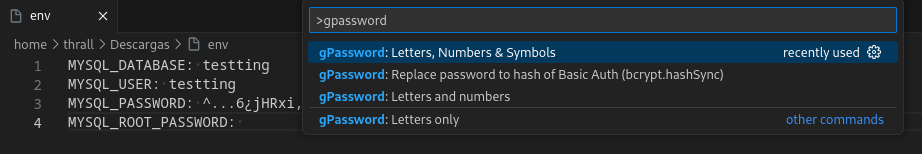
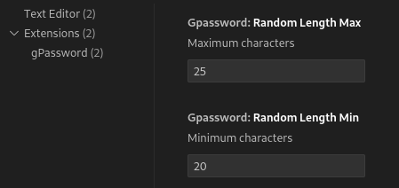

# gPassword

gPassword is an extension to make password generation easier.

## Features

Passwords can currently be generated:

* Letters only
* Letters and numbers
* Letters, Numbers & Symbols
* Replace password to hash of Basic Auth (bcrypt.hashSync)

## Settings

By default, passwords are generated with a random size between 20 and 25 characters, but it can be changed in the settings:

* `gpassword.randomLengthMin`: Between 15 and 54
* `gpassword.randomLengthMax`: Between 16 and 55

> If the minimum value is defined greater than the maximum value, a controlled error will occur.

**Enjoy!**
